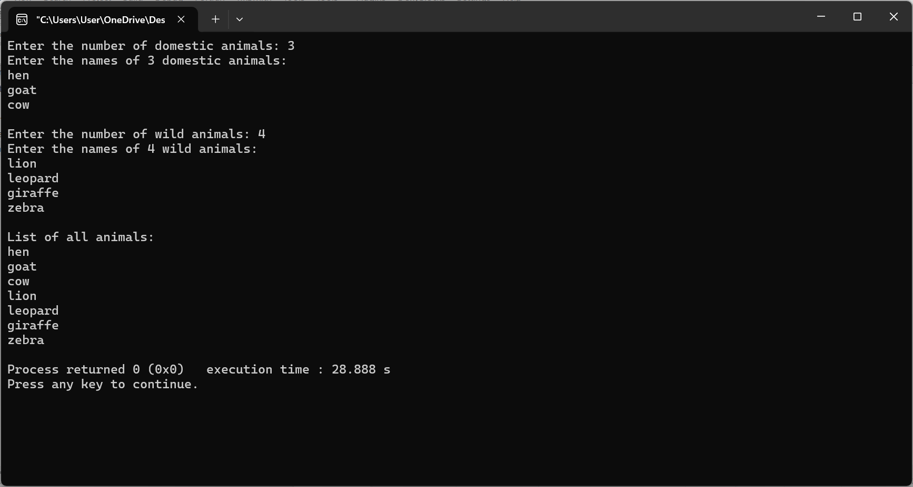
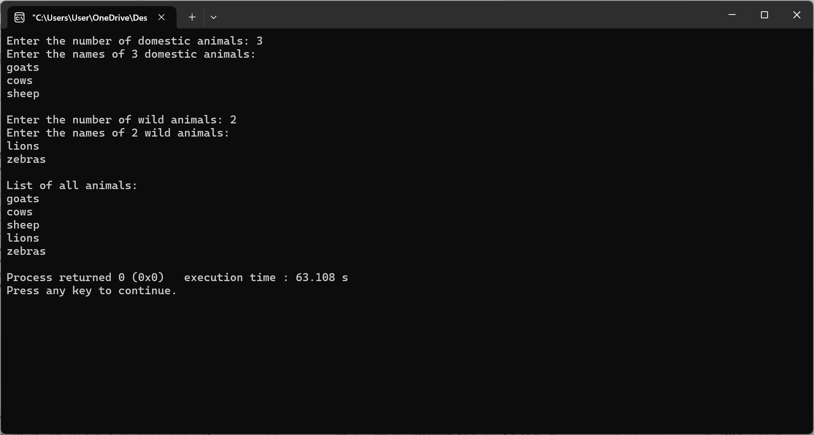

# Intro-to-Data-Structures-and-Algorithm
 INTRODUCTION TO DATA STRUCTURES AND ALGORITHM
# Intro to Data Structures and Algorithm

## Description
This repository contains two C programs:
- **Student Marks Calculator:** Computes the average marks in Physics, Chemistry, and Math.
- **Animal Counter:** Accepts `N` domestic animals and `X` wild animals, then prints the total.

## Compilation & Execution
### Compile:
## Program Output

### 1. Student Marks Calculator
This program calculates the average marks of a student.

### 2. Animal Counter
This program accepts `N` domestic and `X` wild animals and prints the total.

