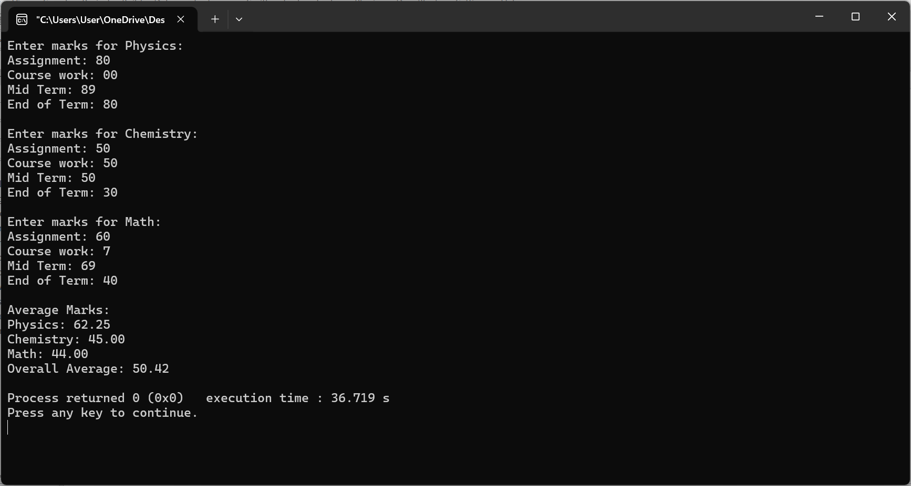
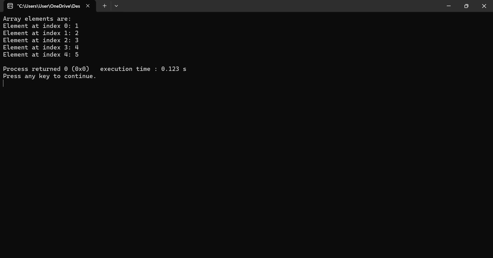
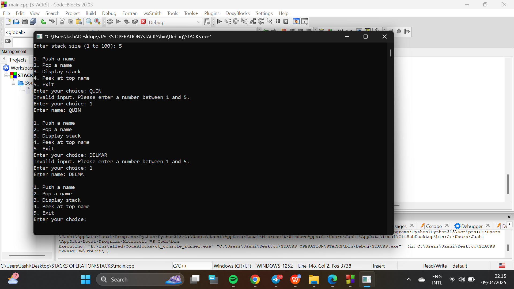

# Intro-to-Data-Structures-and-Algorithm
 INTRODUCTION TO DATA STRUCTURES AND ALGORITHM

## Description
This repository contains two C programs:
- **Student Marks Calculator:** Computes the average marks in Physics, Chemistry, and Math.
- **Animal Counter:** Accepts `N` domestic animals and `X` wild animals, then prints the total.

### 1. Student Marks Calculator
This program calculates the average marks of a student.

### 2. Animal Counter
This program accepts `N` domestic and `X` wild animals and prints the total.

### 3. C code showing how to tranverse an array 

# 🧠 Stack of Names (C++ Project)

A simple terminal-based program in C that demonstrates the **Stack (LIFO)** data structure using names. The user can push, pop, display, and peek at names in the stack, with input validation and dynamic stack size configuration.

---

## 📌 Features

- Push names onto a stack with validation
- Pop names off the stack
- Peek at the top name
- Display the entire stack
- Input validation for names and menu options
- Configurable stack size (1 to 100)

---

## 🛠️ Built With

- **C Language**
- GCC Compiler (or any standard C compiler)
- Command-line Interface (CLI)

---

## 🚀 How It Works

1. The program prompts the user to enter a desired stack size (between 1 and 100).
2. A menu interface allows:
   - **Push**: Add a valid name (letters and spaces only).
   - **Pop**: Remove and view the top name from the stack.
   - **Display**: View all names currently in the stack.
   - **Peek**: View the name on top of the stack without removing it.
3. The program loops until the user chooses to exit.

---

## 📸 SCREENSHOT

---

✍️ Author

--KATEGAYA ROMEO--

